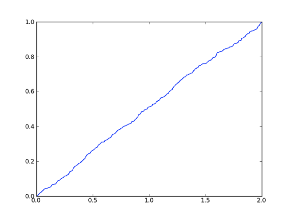
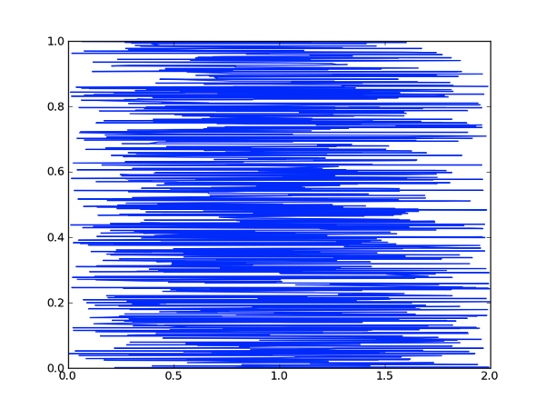

# Problem 2

 Consider the following code:

```python
import random, pylab
xVals = []
yVals = []
wVals = []
for i in range(1000):
    xVals.append(random.random())
    yVals.append(random.random())
    wVals.append(random.random())
xVals = pylab.array(xVals)
yVals = pylab.array(yVals)
wVals = pylab.array(wVals)
xVals = xVals + xVals
zVals = xVals + yVals
tVals = xVals + yVals + wVals
```
For each of the following questions, select the best answer from the set of choices.

## Problem 2-1
2.0/2.0 points (graded)</br>
The values in tVals are most closely:

Distributed with a Gaussian distribution - Correct

## Problem 2-2
2.0/2.0 points (graded)</br>
The values in xVals are most closely:

Uniformly distributed - Correct


For each of the following expressions using the code above, match the following calls to `pylab.plot` with one of the graphs shown below.

**Graph 1**</br>

**Graph 2**</br>

**Graph 3**</br>

**Graph 4**</br>

**Graph 5**</br>

**Graph 6**</br>


## Problem 2-3
2.0/2.0 points (graded)</br>
`pylab.plot(xVals, zVals)`

Graph 5 - Correct

## Problem 2-4
2.0/2.0 points (graded)</br>
`pylab.plot(xVals, yVals)`

Graph 4 - Correct

## Problem 2-5
2.0/2.0 points (graded)</br>
`pylab.plot(xVals, sorted(yVals))`

Graph 3 - Correct

## Problem 2-6
2.0/2.0 points (graded)</br>
`pylab.plot(sorted(xVals), yVals)`

Graph 2 - Correct

## Problem 2-7
2.0/2.0 points (graded)</br>
`pylab.plot(sorted(xVals), sorted(yVals))`

Graph 1 - Correct