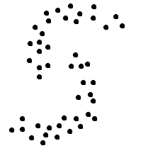
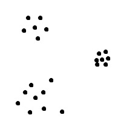
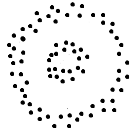
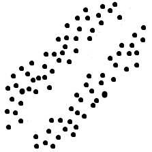
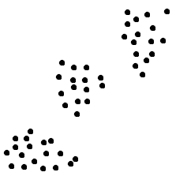
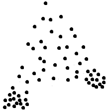

# Problem 5

## Problem 5
12.0/12.0 points (graded) 
K-means is a greedy algorithm, meaning it looks for local minimum when choosing points closest to the centroid. For each dataset illustrated
below, will k-means, as shown in lecture, using Euclidean distance as the metric be able to find clusters that match the dataset patterns?

**Dataset 1** 
 
No - Correct

**Dataset 2** 
 
Yes - Correct

**Dataset 3** 
 
No - Correct

**Dataset 4** 
 
No - Correct

**Dataset 5** 
 
Yes - Correct

**Dataset 6** 
 
No - Correct